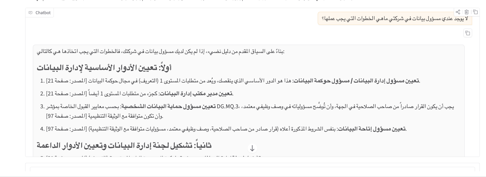
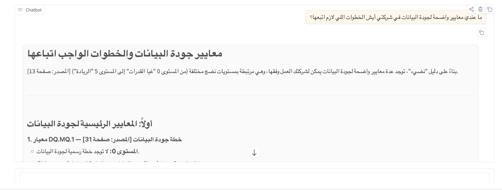

# 📊 Smart Data Governance & Risk Management Platform — NDI

**Course:** Modern Data Engineering for Advanced AI Systems
**Organization:** SDAIA Academy — https://github.com/SDAIAAcademy

A Python-based intelligent platform designed to support data governance analysis, evidence retrieval, compliance-oriented assessment, and technical and administrative risk analysis based on the **National Data Index (NDI / Nadee)** issued by the **Saudi Data and Artificial Intelligence Authority (SDAIA)**.

The platform integrates modern data processing, data quality, governance metadata, persistent vector storage, and advanced Retrieval-Augmented Generation (RAG) into a unified evidence-based pipeline for data governance analysis.

---

# 🏗️ System Architecture

The platform integrates six core components into a unified data and AI pipeline:

1. Data Ingestion & Processing
2. Real-Time Event Processing
3. Vector Database & Semantic Knowledge Base
4. Advanced RAG
5. Data Quality
6. Data Governance & Role-Based Access Control

---

## 1. Data Ingestion & Processing

The platform processes incoming governance and risk-related events through a lightweight event-ingestion and normalization pipeline.

The processing flow includes:

```text
Incoming Event
      │
      ▼
Schema Validation
      │
      ▼
Data Quality Checks
      │
      ▼
Normalization
      │
      ▼
Validated Event
```

The current implementation focuses on **event ingestion, validation, normalization, and persistent vector storage** rather than implementing a full Medallion Architecture.

This distinction reflects the actual implementation of the capstone and avoids representing directory creation or temporary processing as a production data-lake architecture.

---

# 2. Real-Time Data Ingestion Pipeline

The platform implements an asynchronous event-processing pipeline using **`asyncio.Queue`**.

The pipeline simulates a real-time ingestion environment in which governance and risk events can be received and processed asynchronously.

The current processing flow includes:

* Event ingestion through an asynchronous queue.
* Schema validation.
* Data-quality validation.
* Event normalization.
* Duplicate detection.
* Structured processing results.

The architecture provides a foundation for future integration with production streaming technologies such as message brokers or event-streaming platforms.

---

# 3. Vector Database & Semantic Knowledge Base

The platform integrates **ChromaDB** as a persistent local vector database for the SDAIA NDI knowledge base.

The document ingestion pipeline:

* Reads the original NDI PDF.
* Extracts document text using PyPDF.
* Cleans extracted text.
* Splits the document into context-preserving chunks.
* Generates multilingual semantic embeddings.
* Stores embeddings in ChromaDB.
* Preserves document metadata such as source and page information.
* Uses stable identifiers for indexed chunks.

The vector database is persisted locally through ChromaDB's persistent storage mechanism.

The embedding model used is:

```text
paraphrase-multilingual-MiniLM-L12-v2
```

The current chunking configuration uses approximately **900 characters per chunk with a 150-character overlap**, helping preserve contextual continuity between neighboring sections.

---

# 4. Advanced RAG Pipeline

The platform implements an evidence-grounded **Retrieval-Augmented Generation (RAG)** architecture designed to improve retrieval relevance and reduce unsupported AI-generated claims.

The pipeline consists of several stages.

### 🔎 Query Expansion

User queries can be expanded with related terminology to improve retrieval coverage, particularly for governance concepts that may appear under different terms in the source documentation.

### 🔀 Hybrid Retrieval

The retrieval stage combines:

* Semantic vector similarity.
* Lexical relevance signals.

This allows the system to retrieve both semantically related evidence and evidence containing important terminology or keywords.

### 🧠 Maximal Marginal Relevance (MMR)

Retrieved candidates are re-ranked using **Maximal Marginal Relevance (MMR)**.

MMR balances relevance and diversity, reducing redundant chunks while improving the coverage of different pieces of supporting evidence.

### 📚 Grounded Generation

The retrieved evidence is provided to the language model as the primary context for generating the response.

The system is designed to:

* Answer using retrieved evidence.
* Avoid unsupported claims.
* Indicate when the available evidence is insufficient.
* Provide source and page references where available.
* Avoid presenting AI-generated responses as official SDAIA assessments or regulatory decisions.

When an external LLM is unavailable, the system can fall back to displaying the retrieved evidence rather than fabricating an answer.

---

# 5. Data Quality Engine

A dedicated **Data Quality Engine** validates incoming events before downstream processing.

The current framework evaluates four main dimensions:

### Schema Validity

Verifies that the required fields exist in incoming records.

### Completeness

Measures missing values across the required fields.

### De-duplication

Detects duplicate event identifiers to prevent repeated records from affecting downstream processing.

### Validity

Validates structured fields such as:

* Event timestamps.
* Numeric values.
* Source information.

The platform also includes automated self-tests covering the core data-quality and governance logic.

---

# 6. Data Governance & Role-Based Access Control

The platform incorporates governance metadata and role-based access control to support governance-aware processing.

## Data Catalog & Governance Metadata

Governed assets can be registered with metadata including:

* Data Asset ID
* Data Owner
* Data Domain
* Classification Level
* Retention Period
* Lineage Information
* Allowed Roles

The current lineage model represents the processing path from the original source through:

```text
Source PDF
   ↓
Text Extraction
   ↓
Chunking
   ↓
Embeddings
   ↓
ChromaDB
   ↓
Retrieval
   ↓
AI Response
```

## Role-Based Access Control (RBAC)

The platform checks the user's role before allowing access to the NDI knowledge base.

The current implementation includes example roles such as:

* `data_analyst`
* `governance_officer`
* `auditor`

This provides a foundation for implementing more granular governance-aware access controls in future versions.

---

# 🚀 Technology Stack

| Component              | Technology                              |
| ---------------------- | --------------------------------------- |
| Programming Language   | Python                                  |
| User Interface         | Gradio                                  |
| Vector Database        | ChromaDB                                |
| Semantic Embeddings    | HuggingFace SentenceTransformers        |
| Embedding Model        | `paraphrase-multilingual-MiniLM-L12-v2` |
| Data Processing        | Pandas                                  |
| PDF Processing         | PyPDF                                   |
| Async Processing       | Python `asyncio`                        |
| LLM Gateway            | OpenRouter API                          |
| Retrieval Architecture | Hybrid Retrieval + Vector Search + MMR  |
| AI Architecture        | Retrieval-Augmented Generation (RAG)    |

---

# 📁 Storage Structure

The platform uses persistent ChromaDB storage for the semantic knowledge base.

The main working directory is structured as:

```text
ndi_capstone/
└── chroma_db/
    └── chroma.sqlite3
```

The `chroma_db` directory contains the persistent ChromaDB d_

## ⚠️ Important: NDI PDF File Path

Before running the document ingestion and RAG pipeline, make sure that the path to the **National Data Index (NDI) PDF** matches the actual location of the uploaded file in your Google Colab environment.

The current implementation uses:

```text
/content/National-Data-Index_v1.0_AR.PDF
```

If the PDF is uploaded to a different location, **update the file path in the relevant notebook cell before running the PDF ingestion process**.

For example, if the file is stored in Google Drive, replace the current `/content/` path with the corresponding Google Drive path.

> **Note:** The file path is environment-specific and may need to be changed when the notebook is executed in a different Colab session or environment.

---

# 💬 Interactive AI Governance Assistant — Output

The following screenshot demonstrates the interactive **NDI Governance & RAG Chat** interface and an example of an evidence-grounded response with retrieved source references.



